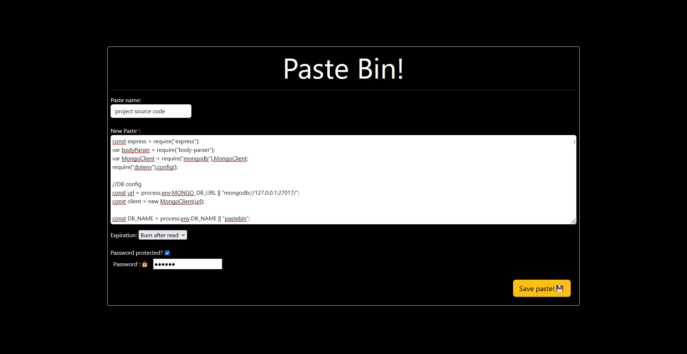
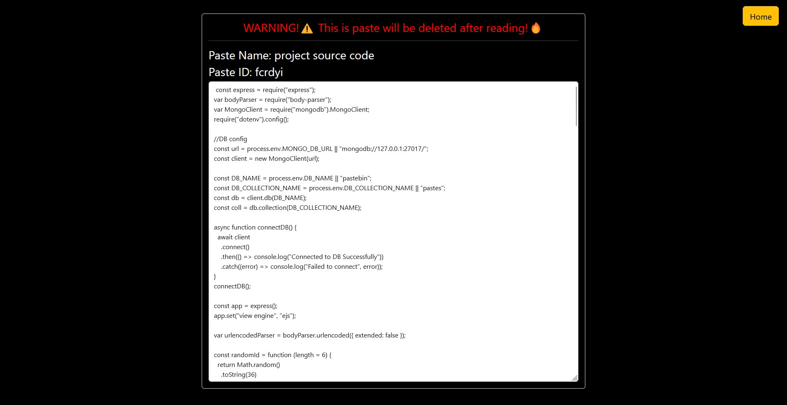

# Paste Bin Clone

###  What is Paste Bin?
[Paste Bin](https://pastebin.com/ "Paste Bin") is a popular website where you can store any text online for easy sharing. 
This project is developed using NodeJS (Express JS) and MongoDB.  EJS is used to generate the html pages.

------------

###  How to use?
1. Enter a paste name (optional)
2. Type / Paste content (required)
3. Set expiration:
   - Never expire
   - Expire on read
   - Set Expire time from 1 minute upto 60 minutes
4. Enable / Disable password protection
5. Save Paste

A unique Paste ID will be generated which can be shared with anyone.

</img>

------------

###  How to Run the server?
#### Required dependencies:
- [Express JS](http://www.npmjs.com/package/express "Express JS")
- [MongoDB](https://www.npmjs.com/package/mongodb "mongodb")
- [EJS](https://www.npmjs.com/package/ejs)
- [Nodemon](https://www.npmjs.com/package/nodemon)

`$ npm i` to install required Packages

##### To run the development server:
`$ npm run dev`

##### To run the production server:
`$ npm run prod`

The app will then be accessible at [localhost:3000](http://localhost:3000 "localhost:3000"). The default port is 3000, however this can be changed in the .env, or enter the server IP address and port after [port forwarding](https://en.wikipedia.org/wiki/Port_forwarding "port forwarding").

------------
###  Screenshots:
</img>
  
</img>

------------
###  Contributions:
If you are interested in this project, make sure to add it to your favorites or give a ⭐ to get the latest updates.
I am open to improvements especially in the server code.
Please feel free to clone this repository and modify or improve anything as you wish.
Check out my other games 👉🏻 [here](https://shreyas-rao.itch.io/ "here")
 
